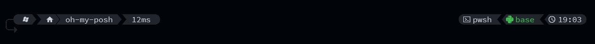
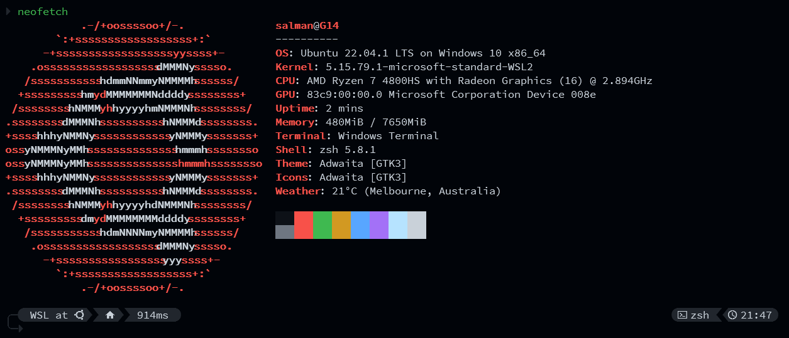
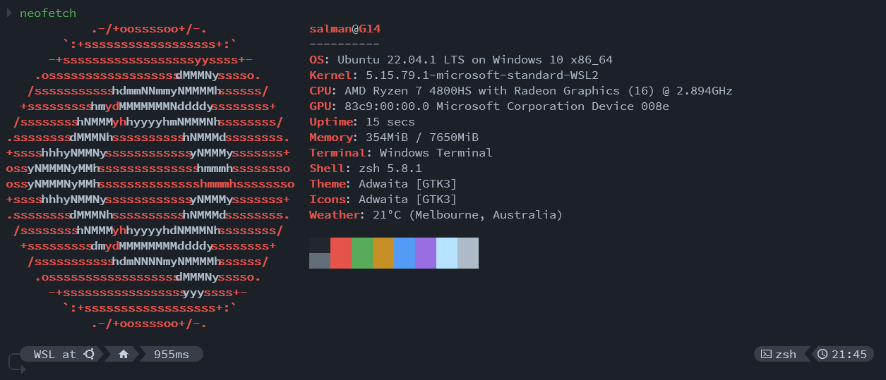
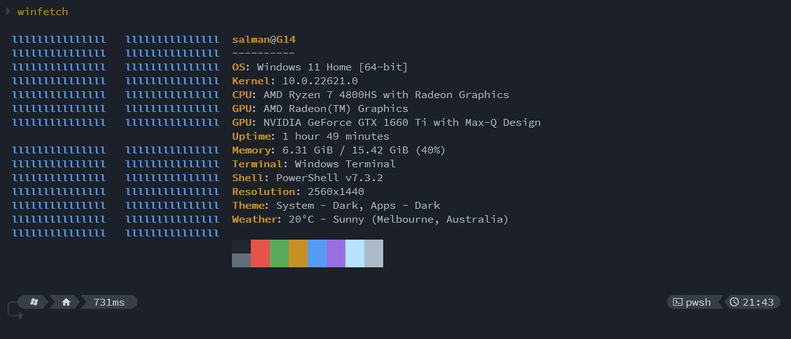
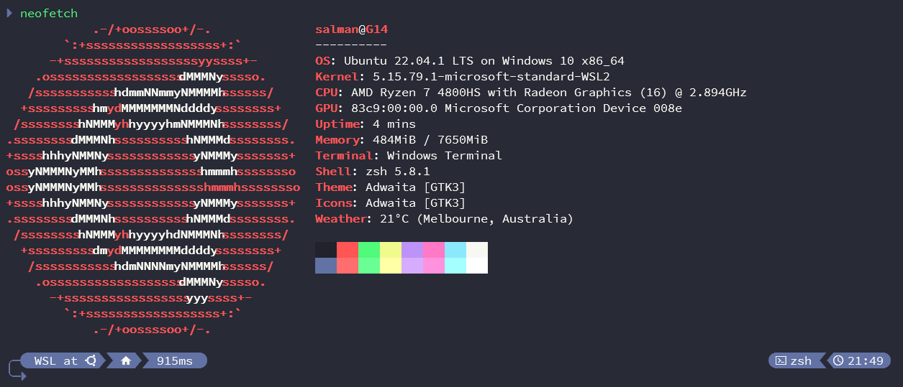
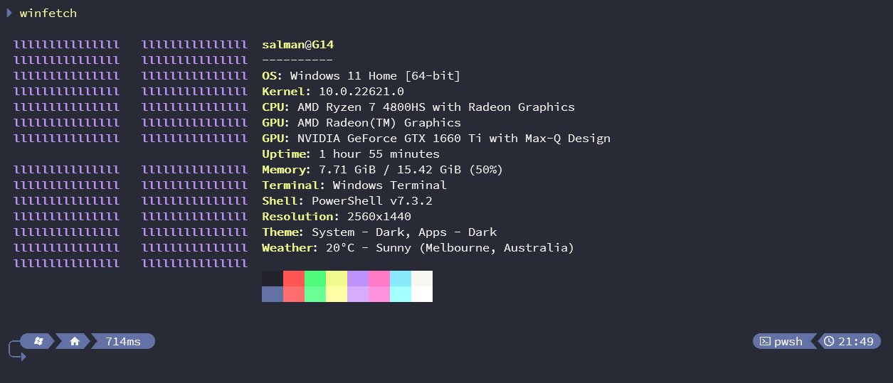

# elegance.omp 🎴
The elegance theme for Oh-My-Posh is a sleek and aesthetically pleasing theme that is perfect for those who value clean lines, simplicity, and a touch of sophistication. It strikes the perfect balance between functionality and style.

Available in three unique color flavors, each offering its own unique look and feel.

## GitHub Dark
This flavor boasts GitHub's signature dark palette, complete with deep shades of grey and black and crisp white text for clarity. Ideal for those who prefer a classic and traditional look.

## GitHub Dim
A lighter, more subtle take on GitHub's Dark theme, this flavor features soft greys and whites for a relaxed and peaceful workspace.

## Dracula
Bold and vibrant, this flavor is based on the iconic Dracula theme. Perfect for those who want their prompt to stand out with its distinctive and striking palette.

### Credits
- JanDeDobbeleer's OhMyPosh prompt theme [engine](https://github.com/JanDeDobbeleer/oh-my-posh)
- Built on the foundation of Night-Owl's Oh-My-Posh [theme](https://github.com/JanDeDobbeleer/oh-my-posh/blob/main/themes/night-owl.omp.json)
- GitHub Primer primitives colour [palette](https://primer.style/primitives/colors)
- Dracula colour [palette](https://draculatheme.com/contribute)
